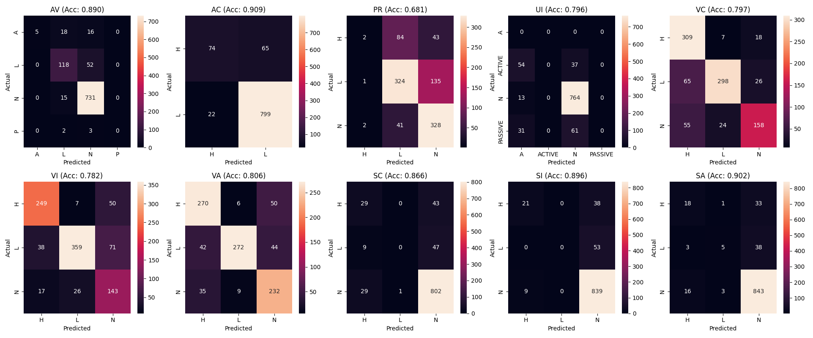

# CVSS Vector Calculator/Prediction app

<!--  -->
<figure>
<center></center>
<figcaption>Heatmapa</figcaption>
</figure>

1. Train models with
   ```sh
   python install -r requirements.txt
   python train_models.py
   ```
   OR
   download them from drive
2. Run app
   standalone python script
   ```sh
   python predict_flags.py
   ```
   OR
   webapp
   <b>Refer to /webapp </b>
   ```sh
   python main.py
   ```

   
